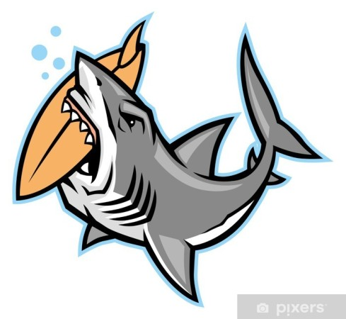

## Shark Attack
Estudio mediante utilización de métodos y funciones de las librerías pandas, numpy y matplotlib para visualización de resultados y conclusiones del estudio.

valign="center"

En este repositorio se encuentra el estudio llevado a cabo sobre la base de datos que se puede encontrar a continuación: [Global shark attacks](https://www.kaggle.com/datasets/teajay/global-shark-attacks).

A continuación se enumeran los títulos de las columnas de la base de datos con la que se va a trabajar:
* *casenumber*: Nº del caso
* *date*: Fecha
* *year*: Año del ataque
* *type*: Tipo del ataque - provocado o no provocado
* *country*: País en el que se produjo el ataque
* *area*: Área del país donde se produjo el ataque
* *location*: Localidad del área del país donde se produjo el ataque
* *activity*: Actividad que estaba practicando la víctima
* *name*: Nombre de la victima
* *sex*: Sexo de la victima
* *age*: Edad de la victima
* *injury*: Descripción del daño provocado en la víctima
* *fatal(y/n)*: (Y) si la víctima falleció - (N) si no
* *time*: Hora a la que se produjo el ataque
* *species*: Especie del tiburón
* *investigatororsource*: Investigador o fuente del estudio
* *pdf*: PDF con el caso en estudio
* *hrefformula*: Link al PDF con el caso en estudio
* *href*: Link al PDF con el caso en estudio

